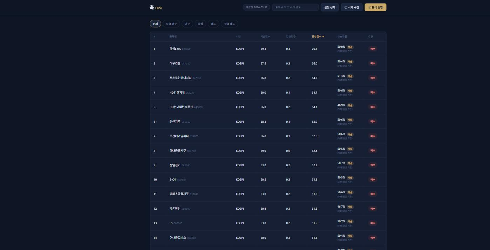

# 촉 (Chok) — AI 기반 한국 주식 분석 대시보드

> "촉이 온다" — 기술적 지표 + 거래량 + AI 뉴스 감성 분석을 결합한 한국 주식 스크리닝 도구


---

## 프로젝트 소개

촉(Chok)은 KOSPI/KOSDAQ 시가총액 상위 100개 종목을 대상으로
**기술적 분석(거래량 포함) + OpenAI 뉴스 감성 분석**을 결합해
종목별 추천 점수와 상승확률을 산출하는 웹 대시보드다.

단순히 지표를 계산해서 보여주는 데서 그치지 않고, **"상승확률"이 실제로 통계적
근거가 있는 값인지 로지스틱 회귀 + walk-forward 검증으로 직접 확인하는 과정**과
**감성분석 LLM이 실제로 정확한지 검증하는 회귀 테스트**까지 프로젝트에 포함되어 있다
(자세한 내용은 [상승확률 예측 — 검증 과정](#상승확률-예측--검증-과정),
[감성분석 정확도 검증](#감성분석-정확도-검증) 참고).



---

## 주요 기능

- 시가총액 상위 100개 종목 자동 수집 (FinanceDataReader)
- 기술적 지표 계산: 이동평균(MA5/20/60), RSI, MACD, 볼린저밴드, **거래량비율 + OBV**
- 네이버 금융 뉴스 크롤링 + OpenAI API 감성 분석
- 기술점수 + 감성점수 가중 결합으로 최종 추천 등급 산출 (STRONG_BUY ~ STRONG_SELL)
- **상승확률**: 로지스틱 회귀 모델(학습됐을 때) 또는 지표 종합 추정치(휴리스틱) — 어느 쪽
  근거인지 화면에 항상 뱃지로 구분 표시
- 대시보드 종목명/티커 검색 + 등급 필터 + **컬럼 헤더 클릭 정렬**
- 분석 실행은 **비동기 + 병렬 처리**로 진행률을 실시간 폴링하며 표시 (브라우저 타임아웃 없음)
- 평일 정규장 마감 후 **자동 수집+분석 스케줄러** (선택적 활성화)
- 앱이 상시 구동되지 않는 환경 대응: **시작 시 오늘자 데이터가 없으면 자동으로 따라잡기**
  (`chok.scheduler.catch-up-on-startup`)
- 분석 실행 시 가격 데이터가 **2일 이상 오래됐으면 대시보드에 경고 배너** 표시(분석 자체는 막지 않음)
- 종목 상세 페이지: 가격 차트(호버 툴팁 + 기간 선택) + 추천 점수 시계열 차트 + 뉴스 목록
- 버튼 클릭으로 수동 실행도 가능 (API 비용 통제)

---

## 기술 스택

| 분류 | 기술 |
|---|---|
| Backend | Java 17, Spring Boot 3.4.0, Spring Data JPA |
| Frontend | Thymeleaf, HTML/CSS, Vanilla JavaScript (SVG 차트, 프레임워크 없음) |
| Database | MySQL 8.0 |
| 데이터 수집 | Python, FinanceDataReader |
| 모델링 | Python, scikit-learn (로지스틱 회귀) |
| AI 분석 | OpenAI API (gpt-4o-mini) |
| Build | Gradle |

---

## 시스템 아키텍처

```
[브라우저]
    │
    ▼
[Spring Boot 백엔드]
    │
    ├── ① 시세 수집 버튼 → Python 수집기 (ProcessBuilder)
    │       └── FinanceDataReader → MySQL 적재
    │
    ├── ② 분석 실행 버튼 → 즉시 응답 + 백그라운드 실행 (AnalysisStatus 폴링)
    │       └── 스레드풀 병렬 처리 (종목 단위 동시 분석)
    │             ├── 기술적 지표 계산 (MA/RSI/MACD/볼린저밴드/거래량/OBV)
    │             ├── 상승확률 계산 (학습모델 있으면 사용, 없으면 휴리스틱)
    │             ├── 네이버 금융 뉴스 크롤링 (jsoup)
    │             └── OpenAI API 감성 분석
    │                   └── 최종 추천 점수 → MySQL 저장
    │
    └── 평일 18:30 자동 스케줄러 (선택) → 위 ①②를 자동 실행

[python-collector/train_model.py] (별도 실행)
    └── MySQL 가격이력 → 특징 계산 → 로지스틱 회귀 학습
          → walk-forward 검증 → model/rise_model.json 저장
          → Spring이 재시작 없이 자동으로 다시 읽어들임
```

---

## 점수 산출 방식

```
최종 점수 = 기술점수 × 0.65 + 감성점수 × 0.35
```

**기술점수 (0~100)**:
- 이동평균 정배열/역배열 (30%)
- RSI 과매수/과매도 (20%)
- MACD 시그널 상/하회 (20%)
- 볼린저밴드 위치 (15%)
- **거래량비율 + OBV 추세 (15%)** — 상승/하락을 거래량이 얼마나 "확인"해주는지 반영

**감성점수 (0~100)**:
- OpenAI API로 뉴스 헤드라인 분석
- POSITIVE(+) / NEUTRAL(0) / NEGATIVE(-) 분류

**상승확률 (0~100%)**:
- 학습된 로지스틱 회귀 모델이 있으면 그걸로 계산 (화면에 "학습" 뱃지)
- 없으면 위 지표 점수들을 조합한 추정치로 대체 (화면에 "추정" 뱃지)
- 어느 쪽이든 "통계 검증된 예측이 아닌 참고용 지표"임을 화면에 항상 명시

---

## 상승확률 예측 — 검증 과정

상승확률을 그냥 지표 조합으로 보여줄 수도 있었지만, **실제로 예측력이 있는지 검증하는
과정 자체**를 만들었다. 이 프로젝트에서 가장 공들인 부분.

1. **로지스틱 회귀 학습** — 종가/거래량 기반 7개 특징(이동평균 괴리, RSI, MACD 히스토그램,
   볼린저 %B, 로그거래량비율)으로 N영업일 뒤 상승 여부를 학습
2. **Ablation study** — 거래량 특징 포함/제외 모델의 홀드아웃 AUC를 비교해 거래량 지표가
   실제로 기여하는지 확인
3. **Walk-forward 검증** — 단일 train/test 분할이 아니라 시간순 5개 구간으로 나눠 반복
   검증. 처음 단일 split에서 "거래량 포함이 더 낫다"고 보였던 차이가, 폴드 평균으로 보니
   표준편차 안에 묻히는 우연이었음을 확인
4. **시장대비 상대라벨 도입** — "그냥 올랐냐"의 절대 라벨은 시장 전체 국면(상승장/하락장)에
   라벨 분포가 크게 휩쓸리는 문제가 있어, "그날 전체 종목 평균보다 잘했냐"로 바꿔 국면
   영향을 줄임
5. **예측 기간 스윕 중 데이터 누수 발견 및 수정** — 3~100영업일 기간을 스윕하던 중 기간이
   길수록 AUC가 비정상적으로 계속 상승하는 패턴을 발견. 원인은 폴드 경계 부근 학습 샘플의
   라벨이 검증 구간의 미래 가격을 참조하고 있던 것(overlapping-label leakage) — 각 샘플이
   실제로 참조하는 미래 날짜(`target_date`)를 추적해 검증 구간을 침범하는 학습 샘플을
   제거하는 **purge 로직**을 추가해 수정

6. **검증 기간을 14개월 → 5년으로 확장** — 짧은 기간 데이터는 상승장 한 국면에만
   갇혀 있어 착시가 생길 수 있다는 문제의식으로, 가격 수집 기간(`PRICE_HISTORY_DAYS`)을
   365일에서 1825일(5년, 2021-09 ~ 2026-09)로 늘리고 `N_FOLDS`도 5 → 10으로 확대해
   재검증했다. 이 구간에는 실제로 하락장(2022, -25%)/반등(2023)/조정(2024)/급등장
   (2025~2026) 국면이 다 섞여 있었다.
   **결과**: 14개월치 검증에서는 전 구간 AUC가 0.5 미만(0.42~0.48, 무작위보다 못한
   "역신호")이었는데, 5년치로 늘리자 AUC가 0.49~0.51로 정확히 0.5 근처로 정상화됐다.
   즉 이전 결과는 상승장 단일 국면에 대한 과적합 착시였다는 게 확인된 것 — "모델이
   좋아졌다"가 아니라 "사실 처음부터 예측력이 없었다"는 더 정직한 결론에 가까워짐.
7. **거시경제 지표 ablation** — KOSPI/KOSDAQ 지수·원달러 환율 모멘텀을 특징에 추가해도
   AUC 개선 없어 폐기 (`ADOPT_MACRO_FEATURES=False`). PER/PBR 등 종목별 밸류에이션
   지표도 검토했으나, FinanceDataReader/pykrx 모두 비로그인으로는 데이터 자체를
   구할 수 없어(pykrx의 재무지표 API는 KRX 개인 계정 로그인 필요) 시도 단계에서 중단.

**현재 결론**: purge 적용 + 5년치 재검증 후에도 AUC가 0.5 근처(랜덤 수준)에 머물러,
지금 확보한 데이터/특징 조합으로는 뚜렷한 예측력을 확인하지 못했다. 그래서 상승확률은
기본적으로 휴리스틱으로 서빙되고, 학습 모델은 검증을 통과할 때만 대체 사용된다.
`backtest.py`로 KOSPI/KOSDAQ을 나눠 기술점수 vs 무작위 선택도 비교했는데, 두 시장
모두 무작위보다 뚜렷이 낫다는 근거를 찾지 못했다 — 결과가 기대에 못 미쳐도 그대로 보고한다.

```
python-collector/train_model.py 상단의 다음 값을 직접 수정해 재실험 가능:
  LABEL_MODE       "relative" | "absolute"
  FORWARD_DAYS     실제 배포 모델이 쓸 예측 기간(영업일)
  SWEEP_HORIZONS   비교해볼 기간 후보 목록
  N_FOLDS          walk-forward 폴드 개수

python-collector/backtest.py로 KOSPI/KOSDAQ 분리 백테스트 재실행 가능.
```

---

## 감성분석 정확도 검증

"뉴스 감성 점수가 진짜 믿을 만한가"를 두 갈래로 나눠서 검증한다 — **분류 정확도**(지금
바로 결과가 나옴)와 **예측 타당성**(주가와의 상관관계, 데이터가 쌓여야 의미가 생김)은
완전히 다른 질문이라 따로 취급한다.

**1. 분류 정확도**
- **정형 테스트셋** (`SentimentAccuracyRegressionTest`, `./gradlew llmTest`로 실행) —
  고재료성 호재/악재, 저재료성 PR, 애매한 초기단계 헤드라인 14개를 실제 LLM에 돌려
  기대 점수 범위와 맞는지 자동 검증. 프롬프트를 바꿀 때마다 재실행하는 회귀 테스트.
  실제 API를 호출해 비용이 들기 때문에 기본 `./gradlew build/test`에서는 제외됨.
- **실제 수집 표본 사람 검토** (`python-collector/sample_sentiment_for_review.py`) —
  점수 구간별로 골고루 뽑아 사람이 동의/비동의를 표시할 수 있는 CSV 생성.
- **일관성 검증** (`python-collector/sentiment_consistency_check.py`) — 근접중복
  판정 로직(`NewsDeduplicationService`)으로 "같은 사건"으로 묶인 헤드라인들의 점수가
  실제로 얼마나 일관되는지 통계.

**2. 예측 타당성 추적** (`python-collector/sentiment_predictive_check.py`)
- 감성점수 구간(긍정/중립/부정)별로 이후 5/10/20영업일 수익률을 추적하는 장치.
- 뉴스는 구조상 과거로 소급 수집이 불가능해서, 이건 지금부터 실시간으로 쌓이는
  데이터로만 검증 가능 — 표본이 쌓인 뒤(수 주~수 개월 후) 그대로 재실행하면 된다.

---

## 실행 방법

### 1. 사전 요구사항

- Java 17+
- Python 3.10+
- MySQL 8.0

### 2. DB 준비

```sql
CREATE DATABASE chok;
```
테이블은 `ddl-auto=update`로 애플리케이션 최초 실행 시 JPA 엔티티 기준으로 자동 생성된다
(별도 스키마 스크립트 실행 불필요).

### 3. 설정 파일

`src/main/resources/application.properties.example`을 복사해서
`application.properties`로 만들고 실제 값(DB 비밀번호, OpenAI API 키, 로컬 파이썬 경로 등)을
채운다. 이 파일은 `.gitignore`에 등록되어 있어 git에 커밋되지 않는다.

### 4. Python 수집기 설정

```powershell
cd python-collector
python -m venv .venv
.venv\Scripts\activate
pip install -r requirements.txt
```

### 5. Spring Boot 실행

```powershell
.\gradlew bootRun
```

### 6. 접속

http://localhost:8080

**① 시세 수집 → ② 분석 실행** 버튼 순서로 클릭.
`chok.scheduler.enabled=true`로 설정하면 평일 18:30에 자동 실행된다.

---

## 프로젝트 구조

```
Chok/
├── src/main/java/com/project/Chok/
│   ├── config/            AppProperties (chok.* 설정 바인딩)
│   ├── controller/        REST API, 대시보드 라우팅
│   ├── domain/             Stock, PriceHistory, TechnicalScore, NewsSentiment, Recommendation
│   ├── dto/                데이터 전달 객체
│   ├── repository/        Spring Data JPA
│   └── service/
│       ├── TechnicalAnalysisService     기술적 지표 + 거래량 지표 계산
│       ├── RiseProbabilityService       학습모델 로드 및 상승확률 계산
│       ├── SentimentAnalysisService     OpenAI API 뉴스 감성 분석
│       ├── NewsCollectorService         네이버 금융 뉴스 크롤링
│       ├── DataCollectionService        Python 수집기 실행 (ProcessBuilder)
│       ├── ModelTrainingService         Python 학습 스크립트 실행
│       ├── RecommendationService        종합 점수/추천등급 산출 (병렬 처리)
│       ├── AnalysisStatus               분석 진행상태 (비동기 폴링용)
│       └── AnalysisScheduler            자동 수집+분석 / 모델 재학습 스케줄
├── src/main/resources/
│   ├── application.properties            (git 미포함 — 실제 값)
│   ├── application.properties.example    (git 포함 — 템플릿)
│   ├── templates/                        dashboard.html, stock-detail.html
│   └── static/                           css, js
└── python-collector/
    ├── collect.py                        시세 수집 (FinanceDataReader, 종목당 5년치 백필)
    ├── train_model.py                    상승확률 로지스틱 회귀 학습 (walk-forward 검증 포함)
    ├── backtest.py                       v1/v2 백테스트 + KOSPI/KOSDAQ 분리 비교
    ├── sample_sentiment_for_review.py    실제 감성분석 표본 사람 검토용 CSV 생성
    ├── sentiment_consistency_check.py    근접중복 헤드라인 간 감성점수 일관성 검증
    ├── sentiment_predictive_check.py     감성점수 vs 이후 수익률 추적 (장기 관찰용)
    ├── config.py / db.py
    └── requirements.txt
```

---

## 성능 최적화

- Python 수집기: 종목당 시세 수집을 짧은 시간 내 완료하도록 구성 (100종목 기준 수 초대)
- Spring 분석: 순차 for-loop 대신 스레드풀(`ExecutorService`, 기본 동시 5개)로 종목별 분석을
  병렬 처리해 전체 소요 시간을 단축
- `② 분석 실행` API는 동기 대기 대신 즉시 응답 + 백그라운드 실행 구조로 전환해, 오래 걸리는
  작업으로 인한 브라우저 타임아웃 문제를 제거

---

## 알려진 제한사항 / TODO

- 뉴스 감성분석은 OpenAI API 크레딧이 있어야 실제로 동작 (`chok.openai.api-key`)
- 뉴스 수집기(`NewsCollectorService`)는 항상 "현재 시점" 최신 뉴스만 가져오는 구조라
  과거 날짜 뉴스를 소급 수집할 방법이 없음 — 감성분석의 예측 타당성 검증은 실시간으로
  쌓이는 데이터로만 가능 (위 [감성분석 정확도 검증](#감성분석-정확도-검증) 참고)
- 5년치 데이터로 재검증해도 상승확률 모델과 기술점수 모두 무작위보다 뚜렷이 낫다는
  근거를 확인하지 못함 — 데이터가 더 쌓이거나 새로운 특징(밸류에이션 지표 등)을
  구할 방법을 찾으면 재검토 필요 (PER/PBR은 현재 무료 데이터소스 부재로 보류)
- "1일" 기간 버튼은 일별 시세 특성상 안내 문구만 표시 (의도된 동작)
- [ ] 미국 주식(S&P 500) 분석 추가
- [ ] Python 수집기 → FastAPI 서버로 마이그레이션
- [ ] 추천 히스토리 차트 시각화 고도화

---

## 주의사항

> 본 프로젝트의 추천 점수와 등급은 참고용 보조 지표다.
> 수익을 보장하지 않으며, 모든 투자 판단과 책임은 사용자 본인에게 있다.
